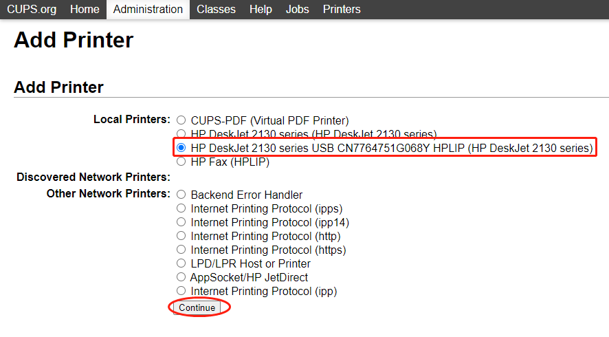
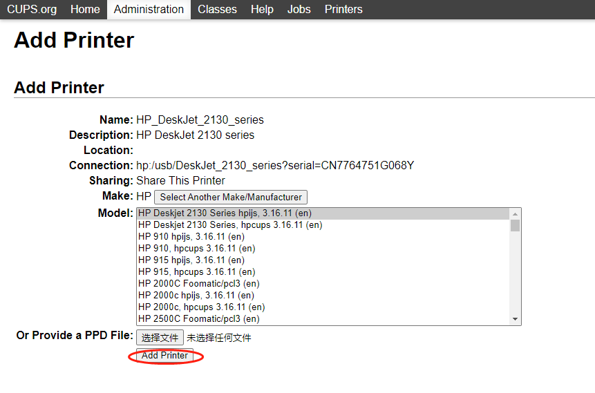
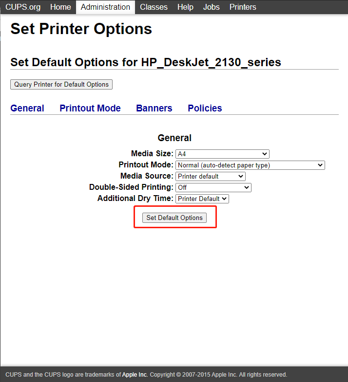
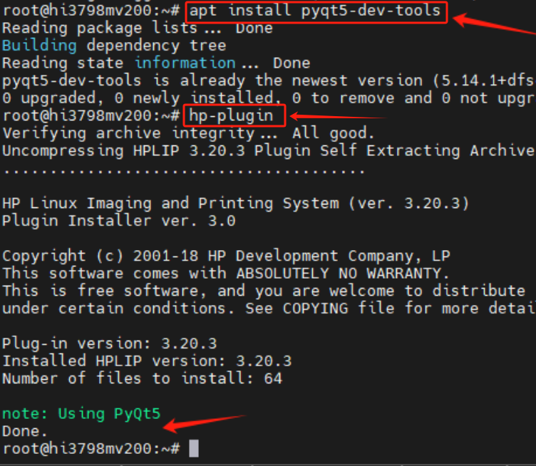
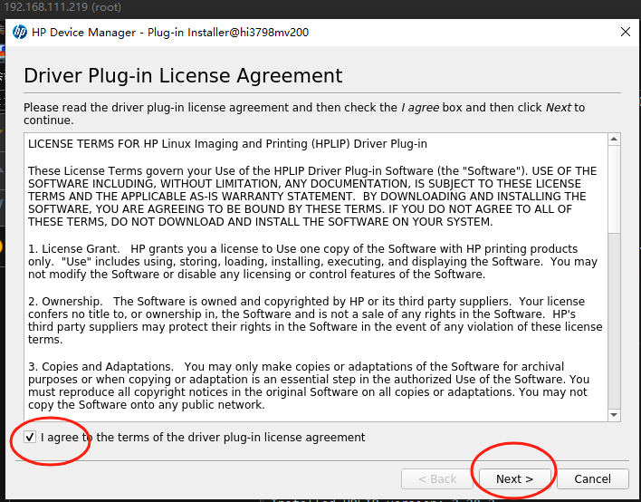

# 专业版 cups 打印服务器

## 升级专业版获取

海纳思专业版内置 Linux-cups 打印服务器程序，  
升级专业版可以获得。

:::tip
[社区版和专业版有什么区别？](/professional)
:::

## CUPS 添加打印机教程

### 1.连接打印机

打开打印机电源并使用数据线连接到盒子 USB 接口上。

### 2.进入设置界面

进入盒子的首页，并右上角选择局域网，点击打印机图标。


### 3.进入管理页面

浏览器会打开新窗口进入 CPUS 管理页面，选择 `管理` 标签然后点击 `Add Printer` 按钮进入添加打印机步骤

用户名和密码，请填写用户名 root 和你设置的终端密码。（默认密码 ecoo1234）


### 4.添加你的打印机

点击按钮后稍等几秒，页面会刷新并列出检测到的所有可添加打印机，下面以 HP2130 打印机为例，  
由于惠普打印机有自己的接口协议，所以识别出来两个打印机，其实是同一个，用的协议不一样，  
如果你也是惠普打印机推荐选择带有 USB 字符的那一个，选择好之后点击 Continue 按钮



接下来的页面刷新后需要填写相关信息，使用默认信息即可，  
另外需要在 Share This Printer 处的选择框打勾，然后点击 Continue 按钮


然后需要选择相应的驱动程序，使用推荐的第一个即可，选择完驱动继续点击 Continue 按钮



设置打印机的相关参数，一般情况默认即可，然后点击 Set Default Options 按钮完成添加操作



此时打印机添加完成，建议使用测试功能打印一张测试纸来测试打印功能是否正常


## 注意事项

### 1.本站收集的 PPD 打印机驱动文件

:::tip
[本站收集的 PPD 打印机驱动文件](https://alist.ecoo.top/aliyun/Linux%E6%89%93%E5%8D%B0%E6%9C%BA%E9%A9%B1%E5%8A%A8)
:::

### 2.惠普系列打印机需要许可认证

如果你的打印机是惠普系列的打印机，根据官方要求，  
首次使用需要执行一次许可认证。

在终端中输入命令 `hp-plugin-ubuntu` 即可。

### 3.惠普系列打印机需要许可认证第二种方法

或者增加安装一个工具包，然后在弹出的窗口界面点击同意。

```bash
histb-deb
apt install pyqt5-dev-tools
hp-plugin
```





最后继续进行打印测试即可。
