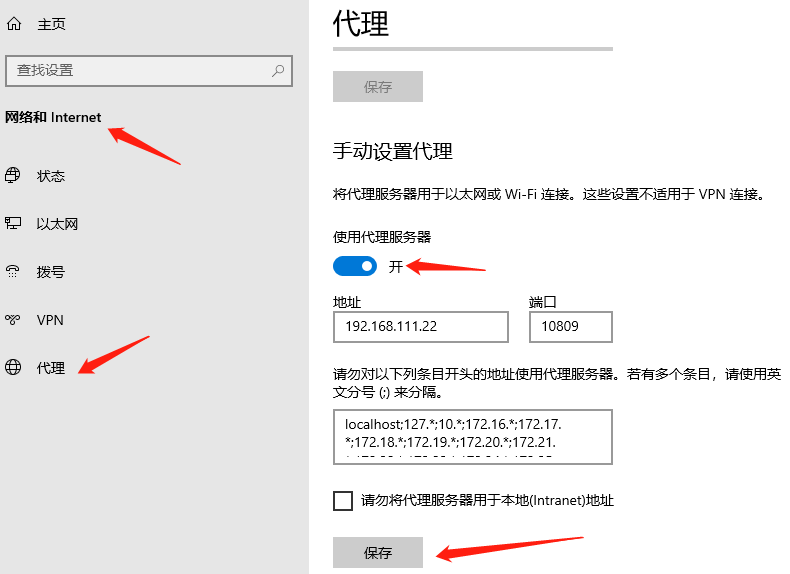
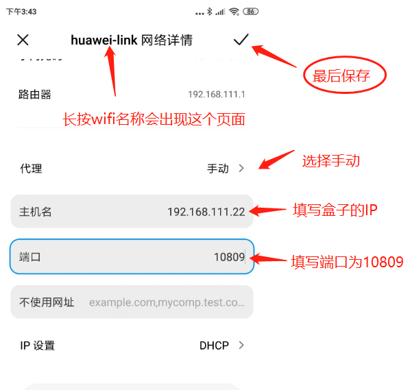

# socks5服务功能

内置一键脚本搭建你的v2ray客户端.  
本章节内容仅仅为技术文章，摘抄于互联网，不涉及违规内容。  
学习的技术禁止用于违法用途！  
用户需要对自己的行为承担全部责任，与本站无关！  
群内讨论相关话题将被踢出！  

## 开始搭建

:::tip
在海纳思系统后台终端输入 ```install-v2ray.sh``` 即可一键搭建v2ray客户端
:::

如下图：  
  


## 添加配置

配置文件的位置：`/usr/local/etc/v2ray/config.json`

这个配置文件vmess的示例：（仅仅为例子，其中的节点信息是失效的，请自行替换可用的节点信息）

```bash
{
  "dns": {
    "hosts": {
      "domain:googleapis.cn": "googleapis.com"
    },
    "servers": [
      "1.1.1.1"
    ]
  },
  "inbounds": [
    {
      "port": 10808,
      "protocol": "socks",
      "settings": {
        "auth": "noauth",
        "udp": true,
        "userLevel": 8
      },
      "sniffing": {
        "destOverride": [
          "http",
          "tls"
        ],
        "enabled": true
      },
      "tag": "socks"
    },
    {
      "port": 10809,
      "protocol": "http",
      "settings": {
        "userLevel": 8
      },
      "tag": "http"
    }
  ],
  "log": {
    "loglevel": "warning"
  },
  "outbounds": [
    {
      "mux": {
        "concurrency": 8,
        "enabled": false
      },
      "protocol": "vmess",
      "settings": {
        "vnext": [
          {
            "address": "104.21.39.154",
            "port": 443,
            "users": [
              {
                "alterId": 0,
                "encryption": "",
                "flow": "",
                "id": "6cb24e08-069f-4b20-83bc-d9ebc1481e35",
                "level": 8,
                "security": "none"
              }
            ]
          }
        ]
      },
      "streamSettings": {
        "network": "ws",
        "security": "tls",
        "tlsSettings": {
          "allowInsecure": false,
          "serverName": "nf.hi-op.tk"
        },
        "wsSettings": {
          "headers": {
            "Host": "nf.hi-op.tk"
          },
          "path": "/vmess"
        }
      },
      "tag": "proxy"
    },
    {
      "protocol": "freedom",
      "settings": {},
      "tag": "direct"
    },
    {
      "protocol": "blackhole",
      "settings": {
        "response": {
          "type": "http"
        }
      },
      "tag": "block"
    }
  ],
  "routing": {
    "domainMatcher": "mph",
    "domainStrategy": "IPIfNonMatch",
    "rules": [
      {
        "ip": [
          "1.1.1.1"
        ],
        "outboundTag": "proxy",
        "port": "53",
        "type": "field"
      }
    ]
  }
}
```

其中的关键参数信息比如：

连接类型：`vmess`  
服务器IP：`104.21.39.154`  
端口：`443`  
网络类型：`ws`  
安全：`tls`  
id密钥：`6cb24e08-069f-4b20-83bc-d9ebc1481e35`  
服务器域名：`nf.hi-op.tk`  
伪装文件夹：`/vmess`   
共享端口：socks5  `10808`   
共享端口：http  `10809`   

这些就是你的节点的关键信息，替换后即可。


编辑修改保存这个配置文件后，输入以下命令重启客服端服务：

```bash
systemctl daemon-reload
systemctl restart v2ray
```

测试是否联通外网：

```bash
curl --socks5 127.0.0.1:10808 google.com
```

当你看到返回信息有301字样，则顺利联通外网，你就可以通过你的节点进行代理上网了。

  


## 应用

以下介绍电脑，手机，火狐浏览器的三种应用场景

### 1.windows电脑上设置

  
  


### 2.手机在局域网里设置wifi

  

### 3.火狐浏览器里设置

  


## 注意事项

