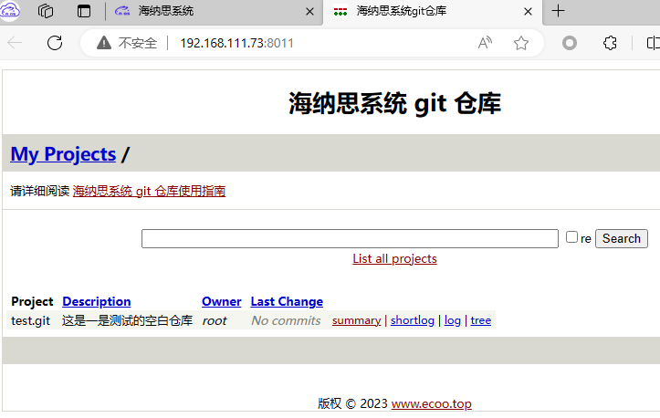

# 自建git仓库

Git 是一个开源的分布式版本控制系统，本节将为大家介绍如何在海纳思系统里创建一个 Git 仓库。  

## 安装和卸载

### 安装

海纳思系统为大家制作了完整的一个搭建 Git 仓库安装包```gieweb-histb.deb```  

在终端中输入如下命令即可安装完成：  
```bash
sudo apt-get update
sudo apt-get install gitweb-histb -y
```

安装完成后，首页的内网选项页就会增加一个图标，点击进去即可  
  
    


### 卸载

在终端中输入如下命令即可卸载：  
```bash
sudo apt-get purge gitweb-histb -y
sudo apt-get autoremove -y
```

## 使用

有很多种 `用户名` 使用方案，我们提供了其中一种， `root` 用户的使用方案。  


### 1.配置文件和位置

- nginx的配置文件在 `/etc/nginx/sites-available/nginx_gitweb`   
- git仓库根目录在  `/var/lib/git`   

### 2.建立新仓库

终端输入如下命令可以建立一个新的仓库(例如 `abc` )：  
```bash
mkdir -p /var/lib/git/abc.git
cd /var/lib/git/abc.git
git init --bare
echo "这是abc仓库" > description
```

### 3.克隆网络上的git仓库  

例如把github上的某个仓库 `sample.git` 克隆下来，作为你自己的一个副本  

```bash
cd /var/lib/git
git clone --bare https://github.com/zhangsan/sample.git
```

### 4.将本地的仓库内容上传到新建的 `abc` 仓库

```bash
git remote add origin root@192.168.111.155:/var/lib/git/abc.git
git push -u origin master
```

### 5.将海纳思git仓库的项目 `abc` 拉取到本地

注意，这里的192.168.111.155是指你的盒子 IP ；  

```bash
git clone root@192.168.111.155:/var/lib/git/abc.git
```

### 6.另一种简易的拉取海纳思git仓库 `abc` 的方法  

注意，这里的192.168.111.155是指你的盒子 IP ；  

```bash
git clone http://192.168.111.155:8011/clone/abc.git
```
为什么作者做这个方案？因为这样，如果用户有公网IP或者穿透域名到8011端口，  
用户就可以远程 git clone 啦！体贴吧。 


### 7.删除仓库 `abc` 

```bash
rm -rf /var/lib/git/abc.git
```

## 将仓库存储空间迁移到外置硬盘

为了更大的存储空间，迁移到外置的硬盘，比如 `/mnt/sda1`   
在挂载的硬盘里建立文件夹 gitweb 
```bash
mkdir -p /mnt/sda1/gitweb
```   

只需要修改几处配置文件即可：  

1.修改配置文件： `/etc/gitweb.conf`    

将第2行的 ```$projectroot = "/var/lib/git";```    

修改为： ```$projectroot = "/mnt/sda1/gitweb";```   

2.修改nginx文件 `/etc/nginx/sites-available/nginx_gitweb`   

将第24行的  `fastcgi_param GIT_PROJECT_ROOT /var/lib/git;`  

修改为： `fastcgi_param GIT_PROJECT_ROOT /mnt/sda1/gitweb;`  

3.如果原来已经有的仓库需要迁移，就拷贝过去  

```bash
cp -ar /var/lib/git/* /mnt/sda1/gitweb/
```

4.最后，重启一次机顶盒


## 注意事项

等待群友体验和反馈


