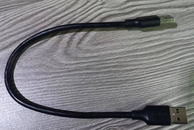
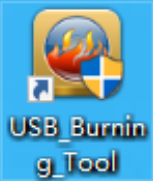
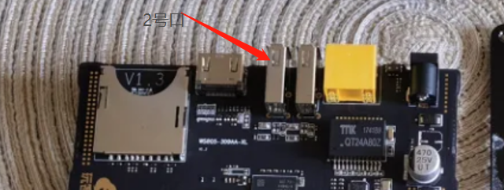
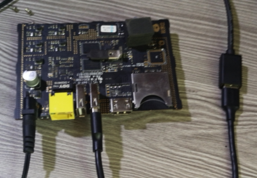
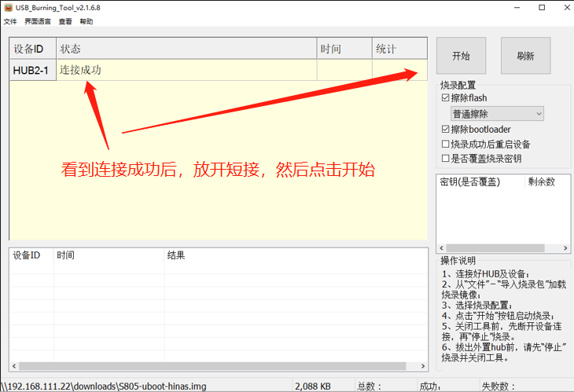
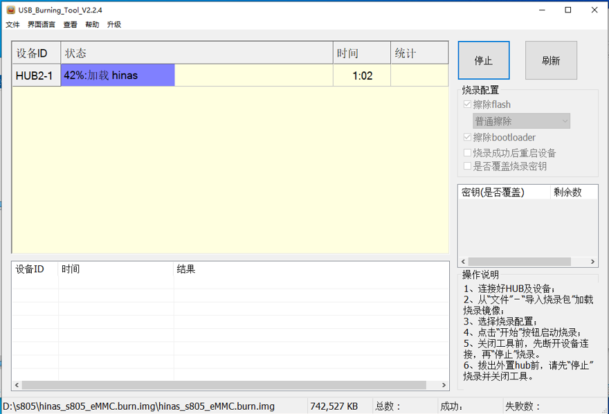
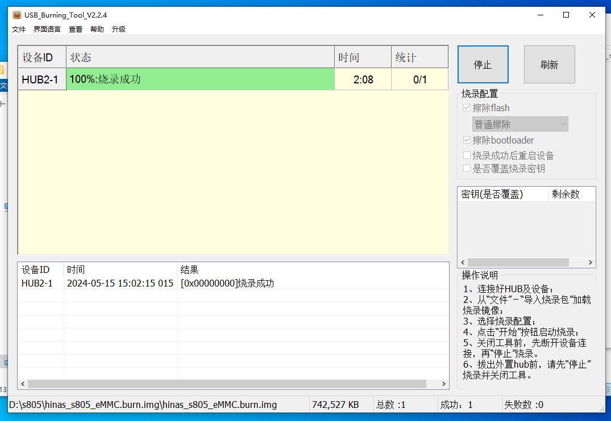

# 玩客云(晶晨S805)刷机

晶晨系列 S805 CPU 机型，又称玩客云，赚3，ws1608, onecloud；  
先刷入作者编译的底包，再刷入系统固件。  

## 一、准备工作  

### 1.准备一个 U 盘，  

同样，需要旧款usb2.0协议的普通 U 盘，建议8-64G的款式，
使用神雕 U 盘格式化小工具，格式化取回全部空间：  
  
:::tip
下载地址：  
[神雕U盘格式化小工具](https://www.ecoo.top/update/soft_init/USBFormat.exe)  
::: 


### 2.准备一个双公头 USB 连接线  

  
  
### 3.拆开盒子，取出主板  

拆解外壳技巧：  
先热用吹风机把背后的pvc贴片吹软，然后用刀具小心撬开。   

  
  

### 4. 准备两个工具软件

下载和安装好:  
  
晶晨烧录工具: [USB_Burning_Tool.exe](https://alist.ecoo.top/d/s805/USB_Burning_Tool_v2.1.3.exe)
USB 镜像烧写工具: [balenaEtcher.exe](https://alist.ecoo.top/d/s805/balenaEtcher-Portable-1.18.4.exe)


### 5. 下载好作者开发的海纳思固件

海纳思系统 U-BOOT 底包: [S805-uboot-hinas.img](https://www.ecoo.top/amlogic/S805-uboot-hinas.img)  2M  
海纳思 U 盘镜像固件:   
下载后请解压。  

| CPU型号            | 下载地址        | 下载地址 | 备注 |
| ------------------ | -------------- | ------------ | ---------| 
| 晶晨S805 | 地址1 | [Ubuntu_hinas_s805_armhf_5.15.79.img.zip](https://node.histb.com:9088/update/system/s805/Ubuntu_hinas_s805_armhf_5.15.79.img.zip)|  |  
|  | 地址2 | [Ubuntu_hinas_s805_armhf_5.15.79.img.zip](https://node2.histb.com/update/system/s805/Ubuntu_hinas_s805_armhf_5.15.79.img.zip)|  |  
|  | 地址3 | [Ubuntu_hinas_s805_armhf_5.15.79.img.zip](https://node3.histb.com:9088/update/system/s805/Ubuntu_hinas_s805_armhf_5.15.79.img.zip)|  |  


## 二、刷入海纳思系统 U-boot 底包

### 1. 找到主板短接点：
不同板子请自行百度短接位置，下面提供作者收集到的图例：  

   
   
   
   

### 2. 双公头 usb 连接：  

双公头 usb 连接线一头接电脑，一头接板子2号口（靠近 HDMI 的一边）  
  
  
  

### 3. 导入海纳思系统专用 U-boot 底包

打开 USB_Burning_Tool 软件工具，导入 S805-uboot-hinas.img 底包

  
  

### 4. 烧写刷入 U-boot 底包

短接住-->打开盒子电源-->显示已连接-->放开短接-->点击 “开始” 按钮  

  
  
  

正常情况下，你短接到位，就一定会显示```已连接``` ;  
如果烧写失败，请检查每个步骤；  
或选择全部擦除的选项试试。  

### 5. 拔掉双公头、关闭软件。  

最后，拔掉双公头连接线，关闭软件。至此，底包刷入完成。  
:::tip
这个动作是一次性的，之后再也不需要刷入底包了。  
可以装好主板盖好盒子了。  
:::

## 三、烧写海纳思 U 盘启动镜像

### 1. balenaEtcher工具将镜像写入 U 盘

打开balenaEtcher工具，插入前面准备好的 U 盘到电脑；  

  
  

注意：软件显示 U 盘成功写完镜像后，务必等待10秒再拔出 U 盘。（知道啥叫作缓存吧）  

### 2. 将 U 盘插入盒子 usb 口上电启动

把 U 盘插到 1 号口（靠近网口的），接上网线到路由器，重新打开电源； 
务必拔出双公头线，拔出SD卡（如果有），插好 U 盘，接好网线 ；  
务必接网线到路由器 LAN 口，否则可能无法初始化成功！  

  
  

注意：如果上图 HDMI 画面出现 `failed to boot` 字样；  

1.启动时务必将 SD 卡拔出，尝试再次上电启动，如多次启动依然卡在画面；   
2.可能 U 盘制作有误，重新格式化多次，重新烧写 U 盘；  
3.可能 U 盘不被启动识别，请更换 U 盘，重新制作烧写 U 盘；  


### 3. 等待 2-3 分钟，首次初始化启动完毕

 等待 2-3 分钟，首次启动完毕，即可到路由器查找自动分配的 IP；  
 这个 IP 在你的路由器客户端列表中，显示的 mac 地址是 `00:11:22:33:44:66`  
 用 [ssh 客户端](https://alist.ecoo.top/d/aliyun/ssh客户端专业版) 登录这个 IP ，即可看到终端安装界面；  
 (是 ssh客户端登录！不是浏览器！！这个时候跑来问浏览器打不开，眼瞎！)  
 ssh 端口 22，用户名 root 默认初始密码 ecoo1234；  

  

进入终端后，输入`format-emmc`,然后按回车键确认；  
  

  

继续输入`install-emmc` 将系统安装到 盒子内部emmc存储中  
注意：一旦选择下载最新版，则内置默认版将自动消失无效；  
要么保持每次选择下载最新版，要么重新制作 U 盘镜像。  
  


## 四、恭喜

最后，恭喜您拥有一台千兆的家用 linux 服务器系统 ！  
我是小盒子，也是大世界！  
海纳思系统，绝对值得拥有！   
   

## 五、常见问题解答

- 1. U 盘不是标准的，造成盒子主板无法识别。
- 2. 同一局域网下多台同款盒子在运行，造成 MAC 地址冲突。


