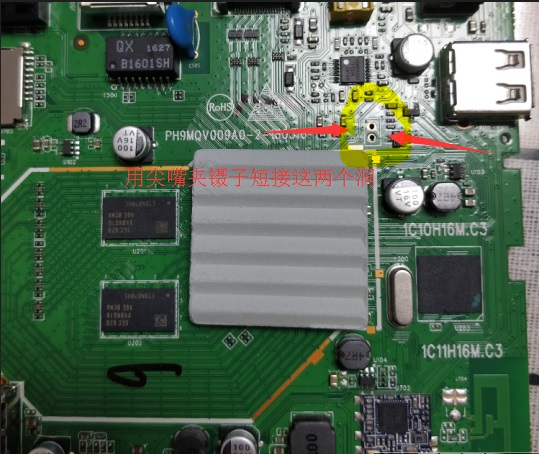
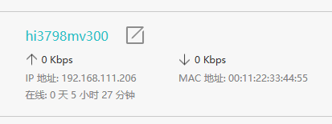
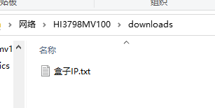
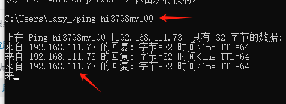
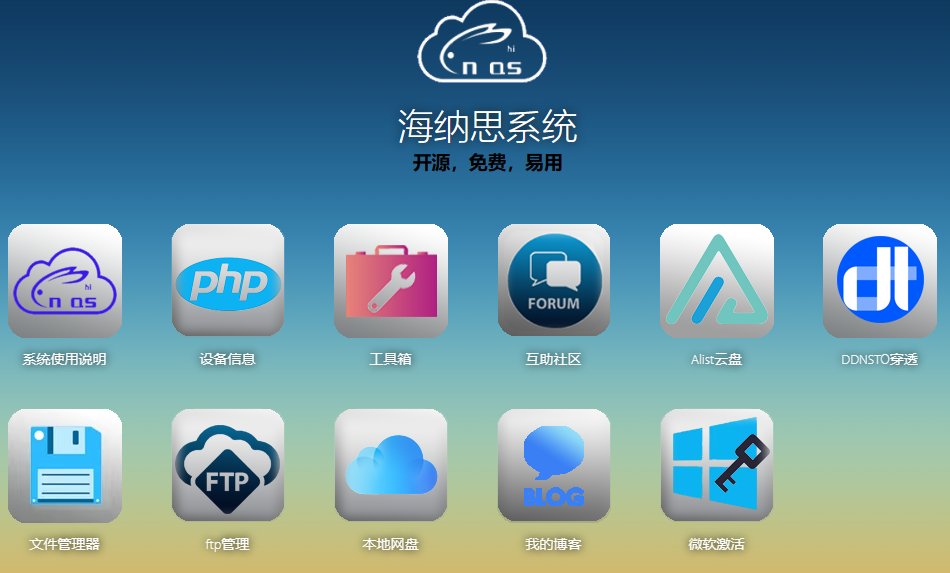

# USB 刷机(海思)

短接盒子的特定电路，让 CPU 判断从 usb 口磁盘读取根目录的 ```fastboot.bin``` 启动，配合启动指令进行刷入NAS系统。

##  准备工作

- 一个 U盘，需要格式化为 FAT16 或者 FAT32 文件系统；  
这个U盘必须是2.0协议的普通U盘，最好是牌子正品的。  
转接器或者硬盘盒之类的 99% 无法被 CPU 即时识别。  
建议 1G-64G 之间容量的 U 盘。  

- 短接板子电路的工具：镊子、刀片或者小铜线；  
- 根据网络搜索，或者厂家电路图，找出你的机顶盒型号的短接点。
- Windows7以上电脑系统。  

##  刷机步骤

### 格式化 U 盘

:::caution
请务必使用此工具格式化你的 U 盘：  
它能把 U 盘格式化为标准的 fat32 格式，并且能让 99% 的老旧 CPU 识别；  
:::
  
:::tip
下载地址：  
[神雕U盘格式化小工具](https://www.ecoo.top/update/soft_init/USBFormat.exe)  
:::

### 下载对应盒子芯片型号的固件
根据[设备适配表](/devices/)，确定你的盒子是哪个fastboot简称的型号，  
下载下表对应的固件包（仅支持armv7系统）：  

| CPU 型号            | fastboot简称        | 下载地址 | 备注 |
| ------------------ | --------------------- | ----------------- | ---------| 
| hi3798mv100 | mdmo1a | [mv100-mdmo1a-usb-flash.zip](https://node2.histb.com/update/system/mv100-mdmo1a-usb-flash.zip)|  |  
| hi3798mv100 | mdmo1b | [mv100-mdmo1b-usb-flash.zip](https://node2.histb.com/update/system/mv100-mdmo1b-usb-flash.zip)|  |  
| hi3798mv100 | mdmo1c | [mv100-mdmo1c-usb-flash.zip](https://node2.histb.com/update/system/mv100-mdmo1c-usb-flash.zip)|  |  
| hi3798mv100 | mdmo1d | [mv100-mdmo1d-usb-flash.zip](https://node2.histb.com/update/system/mv100-mdmo1d-usb-flash.zip)|  |  
| hi3798mv100 | mdmo1f | [mv100-mdmo1f-usb-flash.zip](https://node2.histb.com/update/system/mv100-mdmo1f-usb-flash.zip)|  |  
| hi3798mv100 | mdmo1g | [mv100-mdmo1g-usb-flash.zip](https://node2.histb.com/update/system/mv100-mdmo1g-usb-flash.zip)|  |  
| hi3798mv200 | mv2dma | [mv200-mv2dma-usb-flash.zip](https://node2.histb.com/update/system/mv200-mv2dma-usb-flash.zip)| 待发布 |  
| hi3798mv200 | mv2dmb | [mv200-mv2dmb-usb-flash.zip](https://node2.histb.com/update/system/mv200-mv2dmb-usb-flash.zip)| 待发布 |  
| hi3798mv200 | mv2dmc | [mv200-mv2dmc-usb-flash.zip](https://node2.histb.com/update/system/mv200-mv2dmc-usb-flash.zip)| 待发布 |  
| hi3798mv300 | mv3dmw | [mv300-mv3dmw-usb-flash.zip](https://node2.histb.com/update/system/mv300-mv3dmw-usb-flash.zip)| 待发布 |  
| hi3798mv300 | mv3dmm | [mv300-mv3dmm-usb-flash.zip](https://node2.histb.com/update/system/mv300-mv3dmm-usb-flash.zip)| 待发布 |  

### 解压到 U 盘

将固件包解压到 U 盘的根目录，如下图：  

  
注意：根据型号不同，分别是```mv100/mv200/mv300```的子文件夹。

### 拆开外壳，准备短接点
以下分别是100、200、300已知的型号短接点，作为示例：  
如果你发现有新的短接图纸，请私聊告知群主。  

#### hi3798mv100 的盒子
:::tip
所有hi3798mv100型号的机顶盒短接点都可以通用的短接点：  
CPU 右上角的 1，2 脚 短接法：  
:::  
  
个别已知的例子如下：  
例子 1 ：华为悦盒 ec6108v9c 短接 J16 （用镊子把这两个孔连上）  
华为悦盒 ec6108v9 短接 J15  
注意：如果你发现自己的ec6108v9板子是J16 请使用mdmo1g的刷机包。（部分商家外壳标识不规范）  
 
  

例子 2 ：UNT400B 短接图 （用镊子把这两个孔连上）  
  

#### hi3798mv200 的盒子
:::tip
hi3798mv200的通用短接办法：  
靠近CPU的R37贴片靠外一侧，跟USB口铁壳（地线）短接
:::
  

#### hi3798mv300 的盒子
:::tip
hi3798mv300的盒子目前没有发现通用的短接办法，  
目前只发现一款盒子，移动的魔百盒 301H 如下图：  
短接 c46 （用镊子把这个贴片的两端轻轻而又稳稳地夹住）  
小心别太用力，注意别损坏！
:::
  
  

### 开始刷机

- 1. 将前面准备好的 U 盘插入机顶盒的任一 usb 口；  
（一般靠近电源的 usb 口，也可以尝试另一个口）

- 2. 网线接好，盒子网口接到路由器 LAN 口；  

:::caution
#### 注意：请接好网线刷机，不然 99% 可能刷好以后找不到 IP。  
:::

- 3. 每次刷机都是按照砖头状态来刷的，理论上可以无限次刷！

请按照此动作顺序进行刷机：  

#### 关闭电源 --> 短接住 --> 打开电源 --> 5秒左右放开短接 --> 自动刷机


### 注意事项（无比珍贵的经验）

- 你短接操作后，打开电源就亮原来的安卓欢迎屏(或者原来的屏幕)，代表短接不成功。重新来！  
- 5-8秒后必须放开短接，否则无法写入文件；  
- 正确短接后，打开电源，黑屏约2分钟，然后会亮“正在刷入激动人心的系统”屏；  
- 超过5分钟一直黑屏，代表U盘不被识别，无法传送文件，请更换U盘或插到另一个usb口；  
- 5分钟后亮起第二张屏“我是小盒子也是大世界”和作者二维码，则代表刷完底包；  
- 此时务必等待5-8分钟系统初始化！匆忙断电请重新刷机！  
- 整个过程如果你无法使用HDMI屏幕观察，也可以通过U盘的闪烁灯（常闪）判断是否在刷入；  
- 如果刷完底包后一直无限重启，就是刷错了固件包，请重新更换正确的固件包。  

  
  


### 查找 IP 进入管理页面

1. 在路由器管理页面查找到自动分配给盒子的 IP，浏览器输入 IP 进入系统管理页面  

分配的IP的mac寻址为 00:11:22:33:44:55，很容易查找。  
  

2. 在我的电脑-网络-主机名(hi3798mvxxx)-downloads文件夹下可以找到 IP。  
  
  

3. windows的cmd下，ping主机名，也可以找到IP。  
  

### 恭喜  

  

##  知识点  

能使用 U 盘刷入系统，是作者其中之一的创新，  
在uboot代码中添加了run命令函数，可以让其具有run common的能力，  
然后使用bootargs的启动指令，将U盘中的文件通过自创指令写入emmc，  
具体的实现例子如：  
```html
loadfiler=fatload usb 0 0x1000000 mv100/recoverybox32.ext4
flashpartitionr=mmc write.ext4sp 0x0 0x1000000 0x11000 0x20000
flashrootfs=run loadfiler flashpartitionr
bootcmd=run flashrootfs;
```

关于系统初始化，和network的联通，到出现分配的 IP 地址，interface里采用的是auto模式而不是hotplug模式，目的是开机启动必须自动往上寻址，只要你的网线、路由、DHCP等网络环境是正常的，那么就保证了盒子能够得到分配的 IP 。系统里有很多脚本是需要判断联网（局域网）后才会初始化的，所以，如果你刷机或者开机时，没有连接好网络，就会出现多发性的初始化错误。当然，刷机第一次联网启动完成后，就代表初始化完整了，此后重启不受此影响。当然，这个auto寻址模式也仅仅持续最多等待5分钟，实在没有网络，也会继续初始化。但是你可能需要多等至少5分钟的垃圾时间了。  

当使用hitool工具擦除掉emmc全器件时，emmc内容完全清空，此时CPU启动时会自动跳跃去找usb口的```fastboot.bin```，也就是相当于短接的效果。  

本教程写到这里基本结束了，想说的是，那些拿着作者的教程去卖钱的人士，是不是应该自觉捐款以安慰作者拔凉的心？  


