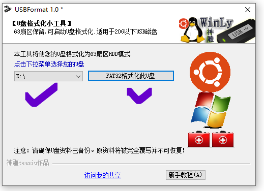
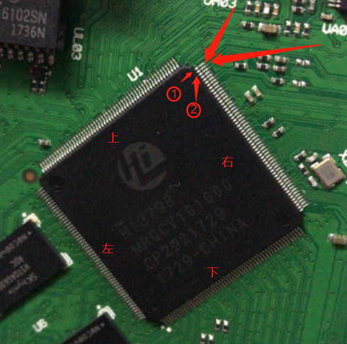

# USB 刷机(海思)

短接盒子的特定电路，让 CPU 判断从 usb 口磁盘读取根目录的 ```fastboot.bin``` 启动，配合启动指令进行刷入NAS系统。

##  准备工作

- 一个 U盘，需要格式化为 FAT16 或者 FAT32 文件系统；  
这个U盘必须是2.0协议的普通U盘，最好是牌子正品的。  
转接器或者硬盘盒之类的 99% 无法被 CPU 即时识别。  
建议 1G-64G 之间容量的 U 盘。  

- 短接板子电路的工具：镊子、刀片或者小铜线；  
- 根据网络搜索，或者厂家电路图，找出你的机顶盒型号的短接点。
- Windows7以上电脑系统。  

##  刷机步骤

### 格式化 U 盘

:::caution
请务必使用此工具格式化你的 U 盘：  
它能把 U 盘格式化为标准的 fat32 格式，并且能让 99% 的老旧 CPU 识别；  
:::
  
:::tip
下载地址：  
[神雕U盘格式化小工具](https://www.ecoo.top/update/soft_init/USBFormat.exe)  
:::

### 下载对应盒子芯片型号的固件
根据[设备适配表](/devices/)，确定你的盒子是哪个fastboot简称的型号，  
下载下表对应的固件包：  

| CPU 型号            | fastboot简称        | 下载地址 |  
| ------------------ | --------------------- | ----------------- |  
| hi3798mv100 | mdmo1a | [mv100-mdmo1a-usb-flash.zip](https://node2.histb.com/update/system/mv100-mdmo1a-usb-flash.zip)|  
| hi3798mv100 | mdmo1b | [mv100-mdmo1b-usb-flash.zip](https://node2.histb.com/update/system/mv100-mdmo1b-usb-flash.zip)|  
| hi3798mv100 | mdmo1c | [mv100-mdmo1c-usb-flash.zip](https://node2.histb.com/update/system/mv100-mdmo1c-usb-flash.zip)|  
| hi3798mv100 | mdmo1d | [mv100-mdmo1d-usb-flash.zip](https://node2.histb.com/update/system/mv100-mdmo1d-usb-flash.zip)|  
| hi3798mv100 | mdmo1f | [mv100-mdmo1f-usb-flash.zip](https://node2.histb.com/update/system/mv100-mdmo1f-usb-flash.zip)|  
| hi3798mv100 | mdmo1g | [mv100-mdmo1g-usb-flash.zip](https://node2.histb.com/update/system/mv100-mdmo1g-usb-flash.zip)|  
| hi3798mv200 | mv2dma | [mv200-mv2dma-usb-flash.zip](https://node2.histb.com/update/system/mv200-mv2dma-usb-flash.zip)|  
| hi3798mv200 | mv2dmb | [mv200-mv2dmb-usb-flash.zip](https://node2.histb.com/update/system/mv200-mv2dmb-usb-flash.zip)|  
| hi3798mv200 | mv2dmc | [mv200-mv2dmc-usb-flash.zip](https://node2.histb.com/update/system/mv200-mv2dmc-usb-flash.zip)|  
| hi3798mv300 | mv3dmw | [mv300-mv3dmw-usb-flash.zip](https://node2.histb.com/update/system/mv300-mv3dmw-usb-flash.zip)|  
| hi3798mv300 | mv3dmm | [mv300-mv3dmm-usb-flash.zip](https://node2.histb.com/update/system/mv300-mv3dmm-usb-flash.zip)|  

### 解压到 U 盘

将固件包解压到 U 盘的根目录，如下图：  

  
注意：根据型号不同，分别是```mv100/mv200/mv300```的子文件夹。

### 拆开外壳，准备短接点
以下是几种已知的型号短接点，作为示例：  
如果你发现有新的短接图纸，请私聊告知群主。  

#### hi3798mv100 的盒子
:::tip
所有hi3798mv100型号的机顶盒短接点都可以通用的短接点：  
CPU 右上角的 1，2 脚 短接法：  
:::  
  
个别已知的例子如下：  
例子 1 ：华为悦盒 ec6108v9c 短接 J16 （用镊子把这两个孔连上）  
华为悦盒 ec6108v9 短接 J15  
注意：如果你发现自己的ec6108v9板子是J16 请使用mdmo1g的刷机包。（部分商家外壳标识不规范）  
 
  

例子 2 ：UNT400B 短接图 （用镊子把这两个孔连上）  
  

#### hi3798mv200 的盒子
:::tip
hi3798mv200的通用短接办法：  
靠近CPU的R37贴片靠外一侧，跟USB口铁壳（地线）短接
:::
  

#### hi3798mv300 的盒子
:::tip
hi3798mv300的盒子目前没有发现通用的短接办法，  
目前只发现一款盒子，移动的魔百盒 301H 如下图：  
短接 c46 （用镊子把这个贴片的两端轻轻而又稳稳地夹住）  
小心别太用力，注意别损坏！
:::
  
  

### 开始刷机

- 1. 将前面准备好的 U 盘插入机顶盒的任一 usb 口；  
（一般靠近电源的 usb 口，也可以尝试另一个口）

- 2. 网线接好，盒子网口接到路由器 LAN 口；  

:::caution
#### 注意：请接好网线刷机，不然 99% 可能刷好以后找不到 IP。  
:::

- 3. 每次刷机都是按照砖头状态来刷的，理论上可以无限次刷！

请按照此动作顺序进行刷机：  

#### 关闭电源 --> 短接住 --> 打开电源 --> 5秒左右放开短接 --> 自动刷机


### 注意事项

- 你短接操作后，打开电源就亮原来的安卓欢迎屏(或者原来的屏幕)，代表短接不成功。重新来！  
- 5-8秒后必须放开短接，否则无法写入文件；  
- 正确短接后，打开电源，黑屏约2分钟，然后会亮“正在刷入激动人心的系统”屏；  
- 超过5分钟一直黑屏，代表U盘不被识别，无法传送文件，请更换U盘或插到另一个usb口；  
- 5分钟后亮起第二张屏“我是小盒子也是大世界”和作者二维码，则代表刷完底包；  
- 此时务必等待5-8分钟系统初始化！匆忙断电请重新刷机！  
- 整个过程如果你无法使用HDMI屏幕观察，也可以通过U盘的闪烁灯（常闪）判断是否在刷入；  


### 查找 IP 进入管理页面


##  知识点

- 首先关闭盒子电源；插上有刷机文件的U盘；短接好盒子的短接点；打开电源；5秒左右放开短接；即可刷机。
- 短接刷机就是刷砖，无需担心变砖，理论上可以无数次刷机；
- 跟安卓短接刷机出现机器人不同点，就是短接后开机2分钟黑屏；如果出现安卓画面，就是没有短接好；
- 大概2分钟左右会出现第一次重启的画面，正在刷入，请稍后3分钟字样的屏幕。
- 3分钟后会重启一次出现另外一个始终静止的画面；此时开始初始化。
- 初始化结束后还会再次重启一次；此时开始进入系统，并从路由器DHCP获取IP。
