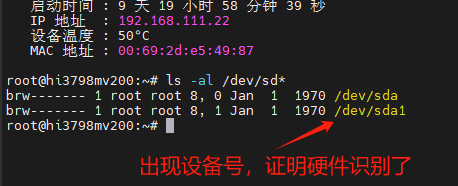

# 磁盘挂载
插入一个u盘、tf卡或usb硬盘，可实现自动挂载。

## 基础常识

- Linux 服务器系统，需要格式化为 ext4 文件系统；  
- 2.5寸的硬盘 5 伏特供电可以共用盒子的 usb 口自带供电；  
- 3.5寸的硬盘，需要自行配置 12 伏特单独供电；  
- 超过 2T 容量的硬盘，需要分区表为 GPT 模式，才能全部容量识别；  
- 极少数型号的盒子，TF卡槽尚不支持。（厂家不是使用通用的管脚配置）；  
- sda 表示设备序号；sda1 表示设备序号的分区号。


## 磁盘分区与格式化

强烈建议将你的磁盘格式化为ext4的文件系统。

在海纳思系统中，普遍使用的是ext4的文件系统。

### 第一步：检查你的磁盘是否被硬件识别

在终端输入命令：  
```bash
ls -al /dev/sd*
```

  


### 第二步：重新分区和格式化

请使用系统自带的磁盘分区命令工具 `fdisk` ：  

```bash
fdisk /dev/sda
```
```html
    输入 o 设置新分区为 msdos 模式（mbr）
    （输入 g 设置新分区为 gpt 模式）
    输入 n 建立新分区
    接着输入 p 建立主分区
    接着默认 2048 字节扇区头和自动的扇区尾
    (按回车即默认)
    输入 w 将上面的操作保存
```

请使用系统自带的磁盘分区格式化命令 `mkfs.ext4` ：

```bash
mkfs.ext4 /dev/sda1
```

强烈建议：
一个磁盘分区为一个区即可，无须多个分区，作为存储，多分区没有什么意义。  
应该使用文件夹来区分用途，而不是使用分区来区分用途。  


## 自动挂载

海纳思系统内置提供了自动挂载外置磁盘的脚本；  
只要你的磁盘格式能被Linux识别，就会自动挂载到 `/mnt/sda1`

输入以下命令可以手动卸载和挂载
```bash
automount -u
automount -a
```
系统会将你的磁盘自动挂载到 ```/mnt/sda1``` 或者 ```/mnt/mmcblk1p1```


